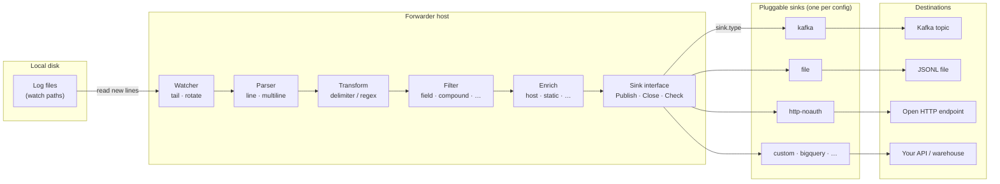

# log-forwarder

A lightweight Go service that tails log files, parses and transforms lines into structured JSON, optionally **filters** records with predicate rules, enriches them with metadata, and publishes them through a **pluggable sink** to the destination you configure.

**User guide:** For install, configuration, sinks, Spring Boot logs, and watermarks, see the [GitHub Wiki](https://github.com/sanjuthomas/log-forwarder/wiki).



The pipeline always ends at the same `sink.Sink` interface. `sink.type` in config selects the implementation; only one sink is active at runtime. Register additional types (for example `http-oauth2` or BigQuery streaming) in a custom binary via `sink.Register`.

## Requirements

- **Go 1.22+**
- A reachable **sink destination** (Kafka cluster, writable file path, or open HTTP endpoint) unless you use a custom sink
- Read access to the log directories configured under `watch`

## Build

Clone the repository and build from the project root:

```bash
go mod download
go build -o bin/log-forwarder ./cmd/log-forwarder
```

Cross-compile for Linux (typical server target):

```bash
GOOS=linux GOARCH=amd64 go build -o bin/log-forwarder-linux ./cmd/log-forwarder
```

Build a binary with custom parsers, transformers, enrichers, or sinks (see [Custom extensions](#custom-extensions)):

```bash
go build -o bin/log-forwarder-custom ./examples/custom
```

## Run

### With defaults

If you omit `-config`, the forwarder uses built-in defaults:

- Watches the **current working directory** for `*.log*` files
- Publishes to Kafka at `localhost:9092`, topic `logs` (`sink.type: kafka`)
- Uses the `delimiter` transformer (tab-separated) with `on_error: wrap`
- Adds the host's hostname via the `host` enricher

```bash
./bin/log-forwarder
```

### With a config file

```bash
./bin/log-forwarder -config configs/example.yaml
```

Start the process from a directory where relative paths in the config resolve correctly, or use absolute paths in the YAML file.

The forwarder logs to stderr and exits cleanly on `SIGINT` / `SIGTERM`.

## Configuration

Configuration is YAML. See [`configs/example.yaml`](configs/example.yaml) for a full example.

### `watch`

Controls which log files are tailed.

| Field | Description |
|-------|-------------|
| `poll` | How often to rescan directories (e.g. `1s`, `500ms`) |
| `sources` | Per-directory watch entries, each with its own `patterns` |
| `paths` | Directories to watch when all use the same `patterns` |
| `patterns` | Glob patterns applied to every path in `paths` |
| `state.path` | Path to the watermark file (default `.log-forwarder/watermarks.json`) |
| `state.flush_interval` | How often to persist watermarks to disk (default `1s`; set `0` to persist every line) |
| `state.flush_every` | Optional count-based flush: persist after this many in-memory updates (default disabled) |

Use **`sources`** when patterns differ per directory, or **`paths`** + **`patterns`** when every directory shares the same globs.

**`sources` example** (different patterns per directory):

```yaml
watch:
  poll: 1s
  sources:
    - path: ./logs/app
      patterns:
        - "*.log"
        - "*.log.*"
        - "*.out"
        - "*.jsonl"
    - path: /var/log/my-service
      patterns:
        - "*.log"
```

**Shared patterns example** (same globs for every path):

```yaml
watch:
  poll: 1s
  paths:
    - ./logs/app
    - ./logs/nginx
  patterns:
    - "*.log"
    - "*.out"
```

The watcher creates missing watch directories, detects new and rotated files (via inode), and reads only lines that have not yet been forwarded.

#### Watermarks

Watermarks track **how far this forwarder process has read** in each tailed **source file**. They belong to the **process** (via `watch.state.path`), not to a particular sink — the watermark file stores only file path, byte `offset`, and `inode`. There is no sink type or destination in the watermark.

That means a **restart does not re-publish** lines that were already read and successfully published, even if you change `sink.type` or sink settings before restarting (for example switching from Kafka to file). The forwarder resumes tailing from the saved offset; only **new** lines after that point go to the new sink. Previously shipped lines are **not** automatically re-sent to the new destination.

**Default location:** `.log-forwarder/watermarks.json` in the forwarder's **current working directory** (the directory you start the process from). Relative paths in config are resolved the same way.

If you run without `-config`, the default is still `.log-forwarder/watermarks.json`. The directory is created automatically on first write.

**Change the location** with `watch.state.path`:

```yaml
watch:
  poll: 1s
  state:
    path: /var/lib/log-forwarder/watermarks.json
    flush_interval: 1s
    flush_every: 0
  sources:
    - path: ./logs/app
      patterns:
        - "*.log"
```

**Persistence:** Watermark updates are kept in memory on every processed line and written to disk on a schedule (`flush_interval`, default `1s`) or after `flush_every` updates when set. A final flush runs on graceful shutdown (`SIGINT` / `SIGTERM`). Set `flush_interval: 0` to persist after every line (previous behavior, higher disk I/O). On crash or `kill -9`, the on-disk watermark may lag by up to one flush window; already-published lines may be sent again after restart (**at-least-once**).

Use an absolute path in production so the file location does not depend on where the service is started from. The forwarder logs the resolved path at startup (`state_path` in the `log forwarder started` message).

**File format** — JSON mapping each tailed file path to a byte offset and inode:

```json
{
  "files": {
    "/var/log/billing/application.log": {
      "offset": 1048576,
      "inode": 883241
    }
  }
}
```

| Field | Meaning |
|-------|---------|
| `offset` | Number of bytes read from the start of the file (including newline characters) |
| `inode` | OS inode of the file when the offset was recorded |

**How it works:**

1. **First run** — no watermark file exists (or no entry for a file). The forwarder tails from the **beginning** of the file.
2. **After each committed parser event** — the in-memory watermark for that source file is updated to the event's byte offset (for multiline records, the end of the last physical line in that event). Filtered and transform-skipped lines advance the watermark too; only publish failures stall it. With `parser.type: multiline`, buffered continuation lines do not commit until the next header line or graceful shutdown — see [Multiline parser and watermarks](#multiline-parser-and-watermarks). The watermark file on disk is updated on the flush schedule (see above).
3. **Restart** — if the file's inode matches the stored value, tailing **resumes from `offset`**. The log line `resuming file from watermark` indicates this.
4. **Log rotation** — if the path is reused but the **inode changed** (typical after `logrotate`), the stored offset is ignored and the forwarder tails the new file from the **beginning**. The log line `tailing file from beginning` indicates this.

**Operational notes:**

- **Re-read from the beginning of a file** — remove that file's entry from the `files` object in the watermark JSON (or delete the entire watermark file to reset all watched files). On the next start the forwarder tails from offset `0` and publishes those lines again to the **current** sink.
- **Change sink and restart** — the existing watermark is **respected**; tailing continues where it left off. To backfill the new sink with older log content, you must clear the relevant watermark entry(ies) as above.
- **Different sinks for the same log files** — run **separate forwarder processes**, each with its own config and `watch.state.path`. One process, one sink; one watermark file per process.
- **Do not place the watermark file inside a watched directory** — config validation rejects paths that would be tailed as log input. Keep it outside `watch.paths` / `watch.sources`, similar to `logging.file`.
- Writes are atomic (write to a `.tmp` file, then rename) to reduce the risk of a corrupted state file on crash.

#### Multiline parser and watermarks

With `parser.type: multiline`, watermark updates are tied to **committed parser events**, not to every physical line the watcher reads.

| Stage | What happens |
|-------|----------------|
| Header line | Starts a new buffer; the **previous** multiline record (if any) is committed and its watermark is set to the **last byte offset of that record** (the final line that belonged to it). |
| Continuation lines | Appended to the buffer only. No publish and **no watermark update** yet. |
| Trailing record | The last event in a file stays buffered until a new header line arrives or the process shuts down gracefully. |

Implications for operators:

- **Watermark can lag the watcher** — byte offsets in `watermarks.json` reflect the last *committed* multiline event, not necessarily the last line already read from the file. A long stack trace at the end of a log file may be tailed but unpublished until the next header line or shutdown.
- **Last record on shutdown** — graceful stop flushes the parser buffer, publishes the trailing record, and updates the watermark. `kill -9` or crash may leave that final multiline event unpublished; on restart the forwarder resumes from the last committed offset and will re-read and re-publish those lines (**at-least-once**).
- **Sidecar / Kubernetes** — if the forwarder restarts before a trailing multiline event is committed, either rely on graceful termination (preStop hook + `SIGTERM`) or ensure the application emits another header line so the buffered record is flushed. Integration tests often append a sentinel header line for this reason (see E2E-2 in [`docs/integration-test-cases.txt`](docs/integration-test-cases.txt)).
- **Line parser for strict per-line watermarks** — use `parser.type: line` when each physical line should commit and advance the watermark immediately (see E2E-3 in the integration test catalog).

The `offset` stored for a committed multiline event is always the end offset of its **last physical line**, not an intermediate line within the stack trace.

### `sink`

Each forwarder **process** configures exactly **one** sink. There is no multi-sink or fan-out in a single config — `sink.type` selects a single implementation (`kafka`, `file`, `http-noauth`, or a custom registered type), and every published record goes to that destination only.

Built-in types: `kafka` (default), `file`, and `http-noauth`. Register custom sinks (for example BigQuery streaming or HTTP with OAuth2) in a custom binary — see [Custom sink](#custom-sink). Watermark behavior is described [above](#watermarks); it is tied to the process and source files, not to which sink type is active.

| Field | Description |
|-------|-------------|
| `type` | `kafka`, `file`, `http-noauth`, or a custom registered type |
| `kafka` | Settings when `type` is `kafka` |
| `file` | Settings when `type` is `file` |
| `http_noauth` | Settings when `type` is `http-noauth` |
| `options` | Free-form map for custom sink implementations |

#### Kafka sink

```yaml
sink:
  type: kafka
  kafka:
    brokers:
      - kafka.example.com:9093
    topic: logs
    connect_timeout: 10s
    security:
      protocol: SASL_SSL
      tls:
        ca_file: /etc/kafka/ca.crt
        cert_file: /etc/kafka/client.crt   # optional — mTLS
        key_file: /etc/kafka/client.key
      sasl:
        mechanism: SCRAM-SHA-512
        username: log-forwarder
        password: secret
```

| `kafka` field | Description |
|---------------|-------------|
| `brokers` | List of broker addresses (e.g. `localhost:9092`) |
| `topic` | Topic to publish JSON records to |
| `connect_timeout` | Startup connectivity check timeout (default `10s`) |
| `security` | Optional TLS and SASL settings |

Omit `security` for unencrypted local development (`PLAINTEXT`).

Supported protocols: `PLAINTEXT`, `SSL`, `SASL_PLAINTEXT`, `SASL_SSL`.

Supported SASL mechanisms: `PLAIN`, `SCRAM-SHA-256`, `SCRAM-SHA-512`, `OAUTHBEARER`. Kerberos (`GSSAPI`) config is accepted but not yet implemented in the sink.

**Example configs for every Kafka security mode:** [`examples/kafka/`](examples/kafka/)

#### File sink

Appends one JSON record per line (JSONL) to a local file. See [`configs/example-file.yaml`](configs/example-file.yaml).

```yaml
sink:
  type: file
  file:
    path: /var/lib/log-forwarder/forwarded.jsonl
```

The parent directory is created if needed. The file path must not be inside a watched directory or match a watch pattern.

#### HTTP sink (no authentication)

POSTs each JSON record to an **open** HTTP ingest endpoint. This built-in sink does not send credentials — no `Authorization` header, API keys, or OIDC token exchange. Use it for local development, trusted internal networks, or endpoints protected by network policy rather than application-level auth.

See [`configs/example-http-noauth.yaml`](configs/example-http-noauth.yaml). For OAuth2 or API-key auth, register a custom sink (a dedicated `http-oauth2` built-in may be added later).

```yaml
sink:
  type: http-noauth
  http_noauth:
    url: http://localhost:8081/ingest
    method: POST
    timeout: 30s
```

Non-2xx responses are treated as publish failures and retried by the pipeline.

### `parser`

Groups physical log lines into logical records before transformation.

| Field | Description |
|-------|-------------|
| `type` | `line` (default) or `multiline` |
| `start_pattern` | For `multiline`: regex that marks the first line of a new record (required) |

**Line parser** (default) — one physical line becomes one record:

```yaml
parser:
  type: line
```

**Multiline parser** — continuation lines are buffered until the next line matching `start_pattern`. Use for stack traces and other multi-line log events (Spring Boot examples below):

```yaml
parser:
  type: multiline
  start_pattern: '^\d{4}-\d{2}-\d{2} \d{2}:\d{2}:\d{2}'
```

A multiline record is **committed** (passed to transform → filter → enrich → publish) only when:

1. The **next** line matches `start_pattern` (the previous record is flushed first), or
2. The forwarder shuts down gracefully (`SIGINT` / `SIGTERM`), when the parser runs `Flush()` on the trailing buffer.

Until then, continuation lines sit in the parser buffer. The watcher may already have read them from disk, but they are not yet published and **do not advance the watermark**. See [Multiline parser and watermarks](#multiline-parser-and-watermarks) below.

### `transform`

Choose a parsing strategy with `type`:

| `type` | Use when |
|--------|----------|
| `delimiter` | Fields are separated by a fixed character (tab, pipe, comma, …) |
| `regex` | Lines match a pattern you can express as a regular expression |
| `tab` | Alias for `delimiter` with tab — kept for backward compatibility |

| Field | Description |
|-------|-------------|
| `type` | `delimiter`, `regex`, `tab`, or a custom registered type |
| `delimiter` | For `delimiter`: field separator (default `\t`). Ignored for `regex`. |
| `columns` | For `delimiter` / `tab`: field names mapped to split columns |
| `pattern` | For `regex`: Go regular expression with named capture groups (required) |
| `on_error` | `wrap` (default) or `skip` — see [Transform errors](#transform-errors) |

**Delimiter example** ([`configs/example.yaml`](configs/example.yaml)):

```yaml
transform:
  type: delimiter
  delimiter: "\t"
  columns:
    - timestamp
    - level
    - message
  on_error: wrap
```

**Regex example** ([`configs/example-regex.yaml`](configs/example-regex.yaml)):

```yaml
transform:
  type: regex
  pattern: '^(?P<timestamp>\S+)\s+(?P<level>\S+)\s+(?P<message>.*)$'
  on_error: wrap
```

**Spring Boot default console format** — multiline parser + regex transform for Logback layout. Example configs per sink:

| Sink | Config |
|------|--------|
| Kafka | [`configs/example-spring-boot-kafka.yaml`](configs/example-spring-boot-kafka.yaml) |
| File (JSONL) | [`configs/example-spring-boot-file.yaml`](configs/example-spring-boot-file.yaml) |
| HTTP (no auth) | [`configs/example-spring-boot-http-noauth.yaml`](configs/example-spring-boot-http-noauth.yaml) |

```yaml
parser:
  type: multiline
  start_pattern: '^\d{4}-\d{2}-\d{2} \d{2}:\d{2}:\d{2}'

transform:
  type: regex
  pattern: '^(?s)(?P<timestamp>\d{4}-\d{2}-\d{2} \d{2}:\d{2}:\d{2}\.\d{3})\s+(?P<level>\S+)\s+(?P<pid>\d+)\s+---\s+\[\s*(?P<thread>[^\]]+?)\s*\]\s+(?P<logger>\S+)\s+:\s+(?P<message>.*)$'
  on_error: wrap
```

Only the `sink` block differs between the three Spring Boot examples — parser, transform, enrichers, and optional filter are shared.

### `timestamp`

Optional normalization of the event time field **after transform, before filter**. Omit the block to leave transformed timestamps as opaque strings (default).

| Field | Description |
|-------|-------------|
| `field` | Record key to parse (default `timestamp`) |
| `format` | Optional Go reference time layout (e.g. `2006-01-02 15:04:05.000`). When empty, built-in layouts are tried: RFC3339/RFC3339Nano, `2006-01-02 15:04:05.000`, `2006-01-02 15:04:05` |
| `default_timezone` | IANA zone for parsed times without an offset (default `UTC`) |
| `output` | Normalized UTC format (v1: `rfc3339nano` only) |

On success the configured field is replaced with UTC RFC3339Nano (e.g. `2026-06-08T15:15:23.456Z`). On parse failure (missing, empty, or unparseable value) the field is set to **processing time** (UTC), with `timestamp_raw` preserving the original string when present and `timestamp_source: processing`.

```yaml
timestamp:
  field: timestamp
  format: "2006-01-02 15:04:05.000"
  default_timezone: UTC
```

### `filter`

Optional predicate-based filtering **after timestamp normalization, before enrich**. Omit the entire block to pass all records (default).

Filtered records are **not** enriched or published. Watermarks still advance so tailing does not stall. Each filtered record increments `log_forwarder_lines_filtered`.

| Field | Description |
|-------|-------------|
| `match` | How top-level rules combine: `all` (AND, default) or `any` (OR) |
| `on_missing` | Default for field rules when a referenced field is absent: `drop` (default) or `pass` |
| `rules` | List of predicate rules (see below) |

**Built-in rule types:**

| `type` | Purpose |
|--------|---------|
| `field` | Compare a transformed field value |
| `compound` | Nested rules with their own `match: all` or `any` |

**Field rule fields:**

| Field | Description |
|-------|-------------|
| `field` | Record field name (for example `level`, `message`) |
| `op` | `eq`, `neq`, `in`, or `not_in` |
| `value` | Required for `eq` / `neq` |
| `values` | Required for `in` / `not_in` |
| `ignore_case` | Case-insensitive string comparison (default `false`) |
| `on_missing` | Override filter-level default when the field is absent |

**Errors only** (common for noisy legacy logs — case-insensitive):

```yaml
filter:
  match: all
  rules:
    - type: field
      field: level
      op: in
      values: [ERROR]
      ignore_case: true
```

**Multiple levels (OR):**

```yaml
filter:
  match: any
  rules:
    - type: field
      field: level
      op: in
      values: [INFO, WARN, ERROR]
      ignore_case: true
```

**AND with nested rules:**

```yaml
filter:
  match: all
  rules:
    - type: field
      field: level
      op: eq
      value: ERROR
      ignore_case: true
    - type: field
      field: service
      op: eq
      value: billing
```

See [`configs/example-filter.yaml`](configs/example-filter.yaml) and [`configs/example-docker-filter.yaml`](configs/example-docker-filter.yaml). Register custom predicate types with `filter.Register` (see [Custom filter](#custom-filter)).

### `enrichers`

A list of enrichers applied in order. Each entry has:

| Field | Description |
|-------|-------------|
| `type` | Enricher name: built-in `static`, `host`, or a custom registered type |
| `fields` | For `static`: key/value pairs added to every record |

```yaml
enrichers:
  - type: static
    fields:
      application_id: billing-service
      environment: prod
  - type: host
```

### `pipeline`

| Field | Description |
|-------|-------------|
| `buffer_size` | Buffered channel size between watcher and pipeline (default `1024`) |
| `on_full` | `block` (default) — watcher waits when the buffer is full; `drop` — discard new lines and increment `log_forwarder_pipeline_buffer_dropped` |
| `publish_timeout` | Per-attempt timeout for `sink.Publish` (default `0` = no limit). Applies to all sink types. |
| `publish_retry.initial_backoff` | Delay before the first retry (default `1s`) |
| `publish_retry.max_backoff` | Maximum delay between retries (default `30s`) |
| `publish_retry.max_attempts` | Give up after this many attempts (`0` = retry until shutdown, default) |
| `max_publish_bytes` | Maximum serialized JSON payload size before publish (default `1048576`, 1 MiB — aligned with Kafka `message.max.bytes`). When exceeded, the configured truncate field is shortened so the record fits. Set to `0` to disable truncation. |
| `truncate_field` | String field to shorten when over the limit (default `message`) |
| `truncate_suffix` | Appended to truncated field text (default `… [truncated]`) |
| `publish_batch.max_bytes` | Sum of serialized JSON sizes in the publish buffer before flush (default `1048576`, 1 MiB). Set to `0` to disable size-based flush. |
| `publish_batch.flush_interval` | Maximum time records wait in the publish buffer (default `100ms`). Set to `0` to disable time-based flush. Set **both** `max_bytes: 0` and `flush_interval: 0` to publish each record synchronously (previous behavior). |
| `publish_batch.on_flush_failure` | Policy when a batch flush fails after retries (default `hibernate`). `hibernate` stops publishing and blocks ingest until cleared. `dead_letter` writes the batch to local JSONL and advances watermarks only after a successful write. |
| `publish_batch.max_attempts` | Per-batch publish attempts before `on_flush_failure` applies (default: `publish_retry.max_attempts`). |
| `publish_batch.hibernate.wake_enabled` | When `true`, periodically retry the stalled batch while hibernating (default `false` — stay hibernating until process restart). |
| `publish_batch.hibernate.wake_interval` | Time between wake retries when `wake_enabled` is `true` (default `10m`). |
| `publish_batch.dead_letter.path` | Directory for failed-batch JSONL files when `on_flush_failure: dead_letter` (required). Validated for write access at startup. Use an ephemeral sidecar volume in Kubernetes. |
| `publish_batch.dead_letter.max_consecutive_batches` | After this many consecutive dead-letter batches without a successful sink publish, transition to hibernate (default `3`). |

`buffer_size` is the **watcher → pipeline** line-event channel depth (event count). `publish_batch` is a separate byte/time buffer **after enrich**, before the sink.

When a publish fails, the pipeline retries with exponential backoff (doubling delay up to `max_backoff`). Watermarks are not advanced until a batch is successfully committed to the sink or dead letter storage. When batch flush retries are exhausted and `on_flush_failure` is `dead_letter`, each failed batch is written to `dead_letter.path` as `{timestamp}_{batch_id}.jsonl`; watermarks advance only after the file is written. If `dead_letter.max_consecutive_batches` is exceeded without a successful sink publish, the forwarder falls back to **hibernate**. When `on_flush_failure` is `hibernate` (the default), the forwarder enters **hibernate** mode: publishing stops, the failed batch’s watermarks stay put, and new lines block on the publish buffer until hibernate is cleared. By default hibernate lasts until the process is restarted; set `publish_batch.hibernate.wake_enabled: true` for periodic self-healing retries against the stalled batch. `/health` stays `200` (the process is alive); `/ready` returns `503` with `reason: sink_hibernating` so load balancers can stop sending traffic without restarting the pod.

Publish batches are flushed on size threshold, timer, or shutdown. While a batch is flushing asynchronously, the pipeline continues appending to a second active buffer; if that buffer fills before the in-flight flush completes, ingest blocks until the sink commit finishes (backpressure). Kafka and file sinks implement `PublishBatch`; other sinks fall back to sequential `Publish` calls per record in the batch.

Oversized records set `publish_truncated: true` and field metadata such as `message_truncated` and `message_original_bytes`. If the record is still too large after truncating the message field, the pipeline tries `_raw` (wrap records) and then the largest string field. UTF-8-safe truncation avoids splitting multibyte characters.

```yaml
pipeline:
  buffer_size: 1024
  on_full: block
  max_publish_bytes: 1048576
  truncate_field: message
  truncate_suffix: "… [truncated]"
  publish_batch:
    max_bytes: 1048576
    flush_interval: 100ms
    on_flush_failure: hibernate
    max_attempts: 0
    hibernate:
      wake_enabled: false
      wake_interval: 10m
  publish_timeout: 30s
  publish_retry:
    initial_backoff: 1s
    max_backoff: 30s
    max_attempts: 0
```

Sink-specific timeouts still apply where configured (for example `sink.http_noauth.timeout` for each HTTP round trip, `sink.kafka.connect_timeout` for startup checks).

### `metrics`

Optional OpenTelemetry metrics exposed over HTTP in Prometheus format. **Disabled by default.**

| Field | Description |
|-------|-------------|
| `enabled` | Start the management HTTP server (default `false`) |
| `host` | Bind address (default `127.0.0.1`) |
| `port` | Listen port (default `8080`) |
| `path` | Metrics scrape path (default `/metrics`) |

```yaml
metrics:
  enabled: true
  host: 127.0.0.1
  port: 8080
  path: /metrics
```

See [Monitoring the forwarder](#monitoring-the-forwarder) for scrape setup, health checks, and alert guidance.

## Built-in transformers

### `delimiter`

Splits each line on a configurable delimiter string. Defaults to tab (`\t`) when `delimiter` is omitted.

- If `columns` is set, values are mapped to those field names; extra columns become `field_N`.
- If `columns` is omitted, fields are named `field_0`, `field_1`, …

**Input:**

```
2024-01-01T00:00:00Z	INFO	service started
```

**Config:**

```yaml
transform:
  type: delimiter
  delimiter: "\t"
  columns:
    - timestamp
    - level
    - message
  on_error: wrap
```

Pipe-delimited example:

```yaml
transform:
  type: delimiter
  delimiter: "|"
  columns:
    - timestamp
    - level
    - message
```

**Output record:**

```json
{
  "timestamp": "2024-01-01T00:00:00Z",
  "level": "INFO",
  "message": "service started",
  "_path": "/path/to/file.log"
}
```

### `tab`

Backward-compatible alias for `delimiter` with tab. Equivalent to `type: delimiter` and `delimiter: "\t"`.

### `regex`

Parses lines with a Go regular expression. Use **named capture groups** for field names.

**Input:**

```
ERROR connection refused
```

**Config:**

```yaml
transform:
  type: regex
  pattern: '^(?P<level>\S+)\s+(?P<message>.*)$'
  on_error: wrap
```

**Output record:**

```json
{
  "level": "ERROR",
  "message": "connection refused",
  "_path": "/path/to/file.log"
}
```

### Transform errors

When a line cannot be parsed:

- **`wrap`** — publish a record with `_raw`, `_path`, and `_error` fields
- **`skip`** — log at debug level and drop the line

Every successfully parsed record also includes `_path` (source file path).

## Built-in parsers

### `line`

Default. Each physical line from the watcher becomes one record for the transformer.

### `multiline`

Buffers lines until the next line matches `start_pattern`, then emits the joined record (newline-separated). The emitted event's offset is the byte position after the **last** line in that record. Continuation lines do not emit events or advance watermarks until the record is committed. Incomplete buffers are flushed on pipeline shutdown (graceful stop). See [Multiline parser and watermarks](#multiline-parser-and-watermarks).

## Built-in enrichers

### `static`

Adds fixed key/value pairs from `fields` to every record.

### `host`

Adds `hostname` (from `os.Hostname()`, or `"unknown"` on failure).

## Built-in filters

Filtering runs on the structured record produced by the transformer. Built-in predicate types:

### `field`

Compares a field in the transformed record.

| `op` | Passes when |
|------|-------------|
| `eq` | Field equals `value` |
| `neq` | Field does not equal `value` |
| `in` | Field matches one of `values` |
| `not_in` | Field matches none of `values` |

When a referenced field is **missing**, the rule uses `on_missing` (`drop` by default). A dropped rule causes the record to be filtered out unless a compound `match: any` rule still passes.

### `compound`

Groups nested `rules` with `match: all` (AND) or `match: any` (OR).

Custom filters implement the `filter.Predicate` interface and register via `filter.Register` — see [Custom extensions](#custom-extensions).

## Built-in sinks

Every destination implements the same interface:

```go
type Sink interface {
    Publish(ctx context.Context, payload []byte) error
    Close() error
}
```

Sinks may also implement `sink.Checker` for a startup connectivity probe. Select the implementation with `sink.type` in config (see [`sink`](#sink) above).

| Type | Description |
|------|-------------|
| `kafka` | Publish JSON records to a Kafka topic (default) |
| `file` | Append JSONL to a local file |
| `http-noauth` | POST JSON to an open HTTP endpoint (no credentials) |

Register custom types with `sink.Register` in a custom binary — for example BigQuery streaming or HTTP with OAuth2.

## Custom extensions

Built-in parsers, transformers, and enrichers are registered in package `init()` functions. To add your own, register factories and build a **custom binary** — the default `./cmd/log-forwarder` entrypoint only includes built-ins.

The full working example lives in [`examples/custom/main.go`](examples/custom/main.go).

### Custom transformer

1. Implement the `transform.Transformer` interface:

```go
type Transformer interface {
    Transform(line []byte) (transform.Record, error)
}
```

2. Register a factory in `init()`:

```go
func init() {
    transform.Register("uppercase_tab", func(cfg config.TransformConfig) (transform.Transformer, error) {
        base, err := transform.New(config.TransformConfig{
            Type:    "tab",
            Columns: cfg.Columns,
        })
        if err != nil {
            return nil, err
        }
        return &uppercaseTab{base: base}, nil
    })
}
```

3. Wrap or replace behavior in your type:

```go
type uppercaseTab struct {
    base transform.Transformer
}

func (u *uppercaseTab) Transform(line []byte) (transform.Record, error) {
    record, err := u.base.Transform(line)
    if err != nil {
        return nil, err
    }
    if msg, ok := record["message"].(string); ok {
        record["message"] = strings.ToUpper(msg)
    }
    return record, nil
}
```

4. Reference the type in config:

```yaml
transform:
  type: uppercase_tab
  columns:
    - timestamp
    - level
    - message
```

The factory receives the full `TransformConfig`, so custom transformers can read `columns`, `pattern`, and `on_error` like built-ins.

### Custom parser

1. Implement the `parser.Parser` interface:

```go
type Parser interface {
    Feed(event watcher.LineEvent) ([]parser.Event, error)
    Flush() ([]parser.Event, error)
}
```

2. Register a factory in `init()`:

```go
func init() {
    parser.Register("my_parser", func(cfg config.ParserConfig) (parser.Parser, error) {
        return &myParser{}, nil
    })
}
```

3. Reference the type in config:

```yaml
parser:
  type: my_parser
```

### Custom enricher

1. Implement the `enrich.Enricher` interface:

```go
type Enricher interface {
    Enrich(record transform.Record) transform.Record
}
```

2. Register a factory in `init()`:

```go
func init() {
    enrich.Register("region", func(cfg config.EnricherConfig) (enrich.Enricher, error) {
        region := cfg.Fields["region"]
        if region == "" {
            region = "unknown"
        }
        return &regionEnricher{region: region}, nil
    })
}
```

3. Implement enrichment (mutate and return the record):

```go
type regionEnricher struct {
    region string
}

func (r *regionEnricher) Enrich(record transform.Record) transform.Record {
    record["region"] = r.region
    return record
}
```

4. Add to config:

```yaml
enrichers:
  - type: region
    fields:
      region: us-east-1
```

Use `fields` to pass arbitrary string configuration into your enricher factory.

### Custom filter

1. Implement the `filter.Predicate` interface:

```go
type Predicate interface {
    Match(record transform.Record) bool
}
```

2. Register a factory in `init()`:

```go
func init() {
    filter.Register("min_level", func(cfg config.FilterRuleConfig) (filter.Predicate, error) {
        return minLevelFilter{min: cfg.Value}, nil
    })
}
```

3. Reference the type in config:

```yaml
filter:
  match: all
  rules:
    - type: min_level
      value: ERROR
```

The factory receives the full `FilterRuleConfig`, so custom filters can read standard fields (`value`, `values`, `field`, …) or you can extend validation for your registered type.

### Custom sink

1. Implement the `sink.Sink` interface:

```go
type Sink interface {
    Publish(ctx context.Context, payload []byte) error
    Close() error
}
```

2. Optionally implement `sink.Checker` for a startup connectivity probe:

```go
type Checker interface {
    Check(ctx context.Context) error
}
```

3. Register a factory in `init()`:

```go
func init() {
    sink.Register("bigquery", func(cfg config.SinkConfig) (sink.Sink, error) {
        project, _ := cfg.Options["project"].(string)
        dataset, _ := cfg.Options["dataset"].(string)
        return newBigQuerySink(project, dataset)
    })
}
```

4. Reference the type in config and pass options:

```yaml
sink:
  type: bigquery
  options:
    project: my-gcp-project
    dataset: application_logs
```

The factory receives the full `SinkConfig`, so custom sinks can read `options` and ignore built-in `kafka` / `file` / `http_noauth` blocks.

### Build and run the custom binary

```bash
go build -o bin/log-forwarder-custom ./examples/custom
./bin/log-forwarder-custom -config configs/example.yaml
```

Copy [`examples/custom/main.go`](examples/custom/main.go) as a starting point for your own entrypoint — it mirrors `cmd/log-forwarder/main.go` but registers custom types before starting the pipeline.

## Testing

### Unit tests

```bash
go test ./...
```

Race detector (CI runs this on every PR to `main`):

```bash
go test -race ./...
```

Verbose output:

```bash
go test -v ./...
```

### Integration tests

Automated end-to-end tests (watcher + pipeline + sink) live in [`internal/integration/`](internal/integration/). Filter scenarios include ERROR-only forwarding, `match: any`, metrics counters, watermark advance on filtered lines, and `on_missing: drop`.

```bash
go test ./internal/integration/ -v
```

See [`docs/integration-test-cases.txt`](docs/integration-test-cases.txt) for the full catalog (E2E-1–E2E-14, CFG-1, KAFKA-1, SMOKE-1).

### Docker smoke tests

```bash
./scripts/docker-smoke.sh    # file sink + ERROR-only filter
./scripts/kafka-smoke.sh     # Kafka round-trip + ERROR-only filter
./scripts/kafka-deadletter-smoke.sh  # Kafka publish failure → dead letter JSONL
```

### End-to-end test with Kafka

**1. Start Kafka** (Docker example):

```bash
docker run -d --name kafka \
  -p 9092:9092 \
  -e KAFKA_NODE_ID=1 \
  -e KAFKA_PROCESS_ROLES=broker,controller \
  -e KAFKA_LISTENERS=PLAINTEXT://:9092,CONTROLLER://:9093 \
  -e KAFKA_ADVERTISED_LISTENERS=PLAINTEXT://localhost:9092 \
  -e KAFKA_CONTROLLER_LISTENER_NAMES=CONTROLLER \
  -e KAFKA_LISTENER_SECURITY_PROTOCOL_MAP=CONTROLLER:PLAINTEXT,PLAINTEXT:PLAINTEXT \
  -e KAFKA_CONTROLLER_QUORUM_VOTERS=1@localhost:9093 \
  -e KAFKA_OFFSETS_TOPIC_REPLICATION_FACTOR=1 \
  -e KAFKA_TRANSACTION_STATE_LOG_REPLICATION_FACTOR=1 \
  -e KAFKA_TRANSACTION_STATE_LOG_MIN_ISR=1 \
  -e KAFKA_GROUP_INITIAL_REBALANCE_DELAY_MS=0 \
  apache/kafka:latest
```

**2. Create a local config** (`configs/local.yaml`):

```yaml
watch:
  poll: 1s
  sources:
    - path: ./logs/app
      patterns:
        - "*.log"

sink:
  type: kafka
  kafka:
    brokers:
      - localhost:9092
    topic: logs

transform:
  type: delimiter
  delimiter: "\t"
  columns:
    - timestamp
    - level
    - message
  on_error: wrap

enrichers:
  - type: static
    fields:
      application_id: test-app
      environment: dev
  - type: host

pipeline:
  buffer_size: 1024
  on_full: block
```

**3. Run the forwarder:**

```bash
mkdir -p logs/app
./bin/log-forwarder -config configs/local.yaml
```

**4. Write a test log line:**

```bash
echo "$(date -u +%Y-%m-%dT%H:%M:%SZ)	info	hello from log-forwarder" >> logs/app/test.log
```

**5. Consume from Kafka:**

```bash
docker exec -it kafka /opt/kafka/bin/kafka-console-consumer.sh \
  --bootstrap-server localhost:9092 \
  --topic logs \
  --from-beginning
```

You should see JSON output with your transformed fields, enricher metadata, and `_path`.

## Monitoring the forwarder

The forwarder exposes three complementary signals for operations: **HTTP metrics**, **periodic status logs**, and **process health** (via your supervisor or orchestrator).

### 1. Enable metrics

Set `metrics.enabled: true` in your config. The forwarder starts a small HTTP server that serves:

| Endpoint | Purpose |
|----------|---------|
| `GET /metrics` | Prometheus scrape endpoint (OpenTelemetry) |
| `GET /health` | Liveness probe — returns `{"status":"UP"}` |
| `GET /ready` | Readiness probe (sink, buffer, hibernate) |
| `GET /deadletters` | Dead letter batch **metadata** only (when `publish_batch.dead_letter.path` is configured) |

Both endpoints share the same `metrics.host` and `metrics.port`. `/health` is only available when metrics are enabled.

```bash
curl http://127.0.0.1:8080/health
curl http://127.0.0.1:8080/metrics
curl http://127.0.0.1:8080/deadletters
```

`GET /deadletters` returns a JSON array of batch metadata (`filename`, `created_at`, `event_count`, `bytes`, `failure_reason`, `sink_type`, `batch_attempts`). It does **not** return log record bodies. Retrieve spilled content from the `dead_letter.path` volume (for example `kubectl exec` in Kubernetes). Do not expose the management port to untrusted networks without authentication.

Bind to `127.0.0.1` when Prometheus runs on the same host. Use `0.0.0.0` only if a remote scraper needs direct access, and restrict access at the network layer.

### 2. Scrape with Prometheus

Add a scrape job targeting the forwarder management port:

```yaml
scrape_configs:
  - job_name: log-forwarder
    static_configs:
      - targets: ["localhost:8080"]
    metrics_path: /metrics
    scrape_interval: 15s
```

If you changed `metrics.path` in config, use that value for `metrics_path`.

### 3. Health and readiness checks

Use `/health` for **liveness** probes. It confirms the management server is running only; it does not verify sink connectivity after startup.

Use `/ready` for **readiness** probes when `metrics.enabled: true`. It returns `503` when:
- the sink fails its connectivity check (when the sink implements `sink.Checker` and `metrics.readiness.sink_check` is true)
- `pipeline buffer depth / capacity` exceeds `metrics.readiness.buffer_threshold` (default `0.8`)
- `metrics.readiness.require_files: true` and no log files are being tailed
- the forwarder is in **hibernate** mode after a failed publish batch (`reason: sink_hibernating`)

Use `/health` for liveness only during hibernate: the process is still running and blocked on backpressure, but it should not receive new traffic until `/ready` is `200` again.

**Kubernetes example:**

```yaml
livenessProbe:
  httpGet:
    path: /health
    port: 8080
  initialDelaySeconds: 5
  periodSeconds: 30
readinessProbe:
  httpGet:
    path: /ready
    port: 8080
  initialDelaySeconds: 5
  periodSeconds: 10
```

Optional readiness tuning:

```yaml
metrics:
  enabled: true
  host: 0.0.0.0
  port: 8080
  readiness:
    path: /ready
    buffer_threshold: 0.8
    sink_check: true
    require_files: false
    sink_check_timeout: 5s
```

Pair readiness with Prometheus alerts on `log_forwarder_publish_failures` and `log_forwarder_pipeline_buffer_depth` for sustained sink or backlog issues.

### 4. Log-based status

Configure periodic status logging to stderr or a log file:

```yaml
logging:
  level: info
  format: json
  status_interval: 30s
```

Every `status_interval`, the forwarder logs a `forwarder status` line with `watched_files` — useful when metrics are disabled or as a secondary signal. Set `status_interval: 0` to disable.

Other useful log lines:

| Log message | Meaning |
|-------------|---------|
| `log forwarder started` | Process is up; includes sources, topic, and metrics address when enabled |
| `sink connectivity verified` | Startup sink check passed |
| `sink unavailable at startup` | Forwarder refused to start — destination unreachable |
| `publish failed, retrying` | Transient publish error; check sink destination and network |
| `forwarder stopped` | Clean or error shutdown |

### 5. Metrics reference

**Forwarder metrics:**

| Metric | Description |
|--------|-------------|
| `log_forwarder_lines_read` | Lines read from watched files |
| `log_forwarder_lines_published` | Lines published to the configured sink |
| `log_forwarder_lines_filtered` | Lines dropped by configured filters (after transform) |
| `log_forwarder_lines_skipped` | Lines dropped (`transform.on_error: skip`) |
| `log_forwarder_pipeline_buffer_dropped` | Lines dropped when `pipeline.on_full: drop` and buffer is full |
| `log_forwarder_transform_errors` | Transform failures |
| `log_forwarder_timestamp_parse_failures` | Records that fell back to processing time during timestamp normalization |
| `log_forwarder_publish_failures` | Failed sink publish attempts |
| `log_forwarder_publish_truncations` | Records truncated to fit `pipeline.max_publish_bytes` |
| `log_forwarder_publish_batch_flushes` | Publish buffer flushes (`reason`: `size`, `timer`, `shutdown`, `wake`; `result`: `success`, `hibernate`, `dead_letter`, `error`) |
| `log_forwarder_publish_hibernating` | `1` when the forwarder is in sink hibernate mode after a failed batch flush |
| `log_forwarder_publish_dead_letter_batches` | Publish batches written to dead letter storage |
| `log_forwarder_publish_consecutive_dlq_batches` | Consecutive dead-letter batches without a successful sink publish |
| `log_forwarder_publish_batch_size` | Records per publish batch flush (histogram) |
| `log_forwarder_publish_batch_bytes` | Serialized JSON bytes per publish batch flush (histogram) |
| `log_forwarder_publish_buffer_active_bytes` | Serialized JSON bytes waiting in the publish buffer |
| `log_forwarder_publish_retries` | Retries after a publish failure |
| `log_forwarder_publish_duration` | Sink publish latency (histogram, seconds) |
| `log_forwarder_files_watched` | Files currently being tailed |
| `log_forwarder_pipeline_buffer_depth` | Events queued between watcher and pipeline |
| `log_forwarder_pipeline_buffer_capacity` | Configured `pipeline.buffer_size` |

**Process and runtime metrics:**

| Metric | Description |
|--------|-------------|
| `process_memory_usage` | Process RSS in bytes |
| `process_cpu_time` | Process CPU time (user/system) |
| `go_memory_used` | Go runtime memory in use |
| `go_memory_allocated` | Heap memory allocated by the application |
| `go_cpu_time` | CPU time spent by the Go runtime |
| `go_goroutine_count` | Number of live goroutines |

### 6. What to alert on

| Signal | Suggested condition | Likely cause |
|--------|---------------------|--------------|
| Publish failures | `rate(log_forwarder_publish_failures[5m]) > 0` sustained | Sink unreachable, auth/TLS issue, or network partition |
| Publish retries | `rate(log_forwarder_publish_retries[5m])` rising | Intermittent sink or timeout pressure |
| Publish latency | `histogram_quantile(0.95, rate(log_forwarder_publish_duration_bucket[5m]))` high | Sink load, network latency, or slow endpoint |
| Buffer backlog | `log_forwarder_pipeline_buffer_depth / log_forwarder_pipeline_buffer_capacity > 0.8` sustained | Pipeline slower than ingest; risk of backpressure |
| No files watched | `log_forwarder_files_watched == 0` while logs are expected | Wrong watch paths, patterns, or permissions |
| Read/publish gap | `rate(log_forwarder_lines_read[5m])` >> `rate(log_forwarder_lines_published[5m])` | Transform skips, filter drops, persistent publish failures, or pipeline stall |
| High filter rate | `rate(log_forwarder_lines_filtered[5m])` high vs `lines_read` | Expected when filtering noisy logs; tune rules if too aggressive |
| Memory growth | `process_memory_usage` or `go_memory_used` trending up without stabilizing | Possible leak or sustained backlog |
| Process down | `/health` failing or scrape target `up == 0` | Crash, OOM kill, or misconfigured port |

### 7. Quick checks

```bash
# Is the management server responding?
curl -sf http://127.0.0.1:8080/health

# Are lines flowing?
curl -s http://127.0.0.1:8080/metrics | grep log_forwarder_lines_

# Is the pipeline backing up?
curl -s http://127.0.0.1:8080/metrics | grep log_forwarder_pipeline_buffer
```

For a single-host deployment, combining Prometheus alerts on publish failures and buffer depth with `status_interval` logs and a systemd `Restart=on-failure` policy gives solid baseline coverage.

## Docker

Container images for sidecar and standalone deployments are published to [Docker Hub](https://hub.docker.com/r/sanjuthomas/log-forwarder) (`linux/amd64`, `linux/arm64`).

```bash
docker compose up --build          # local smoke test (file sink, no filter)
docker compose -f docker-compose.smoke.yaml up --build   # filter smoke (see below)
docker compose -f docker-compose.kafka.yaml up --build   # Kafka round-trip (see below)
docker pull sanjuthomas/log-forwarder:latest
```

### Filter smoke test (file sink)

Round-trip test with an **ERROR-only filter**: INFO/WARN lines are dropped, one ERROR record lands in JSONL, and `/metrics` exposes `log_forwarder_lines_filtered`.

```bash
./scripts/docker-smoke.sh
```

Uses `docker-compose.smoke.yaml` and `configs/example-docker-filter.yaml`.

### Kafka smoke test

Round-trip test: forwarder → Kafka topic → consumer verifies JSON. The smoke config applies an ERROR-only filter (WARN lines are dropped).

```bash
./scripts/kafka-smoke.sh
```

Uses `docker-compose.kafka.yaml` (Apache Kafka KRaft + topic init + forwarder). Requires Docker Compose v2 with `compose up --wait`.

GitHub Actions: **Kafka smoke** runs on every pull request to `main` (required check before merge).

See [docs/docker.md](docs/docker.md) for volume mounts, Kubernetes sidecar notes, and maintainer publish steps.

## Deployment

Binary install on the host is still supported. A typical production setup:

1. Cross-compile the binary for the target OS/arch.
2. Install the binary and config on the host (e.g. `/opt/log-forwarder/`).
3. Ensure the service user can read configured log paths.
4. Point `sink.kafka.brokers` at your production cluster (or switch `sink.type` to `file` / `http-noauth`).
5. Run under a process supervisor such as systemd:

```ini
[Unit]
Description=Log Forwarder
After=network.target

[Service]
Type=simple
User=logforwarder
WorkingDirectory=/opt/log-forwarder
ExecStart=/opt/log-forwarder/log-forwarder -config /opt/log-forwarder/config.yaml
Restart=on-failure
RestartSec=5

[Install]
WantedBy=multi-user.target
```

For custom transformers or enrichers, deploy the binary built from your own entrypoint (e.g. `./examples/custom`) instead of `./cmd/log-forwarder`.

## Project layout

```
cmd/log-forwarder/     Main entrypoint (built-in parsers/transformers/enrichers/filters only)
configs/               Example and local config files
docker/                Sample log data for docker compose
Dockerfile             Multi-stage image (Alpine runtime, non-root forwarder)
docker-compose.yaml    Local container smoke test (file sink)
docker-compose.smoke.yaml  Filter smoke test stack (file sink, ERROR-only)
docker-compose.kafka.yaml  Kafka round-trip smoke test stack
scripts/docker-smoke.sh    Automated file-sink filter verification
scripts/kafka-smoke.sh     Automated Kafka publish/consume verification
scripts/kafka-deadletter-smoke.sh  Kafka sink failure → dead letter spill + metrics
examples/custom/       Custom binary with registered extensions
internal/
  config/              YAML loading and validation
  metrics/             OpenTelemetry metrics and HTTP endpoints
  watcher/             File tailing and rotation detection
  parser/              Parser registry and built-ins (line, multiline)
  transform/           Transformer registry and built-ins (delimiter, regex, tab)
  filter/              Predicate registry and built-ins (field, compound)
  enrich/              Enricher registry and built-ins (static, host)
  pipeline/            Transform → filter → enrich → publish orchestration
  sink/                Pluggable sinks (kafka, file, http-noauth)
```

## License

This project is licensed under the [MIT License](LICENSE).
