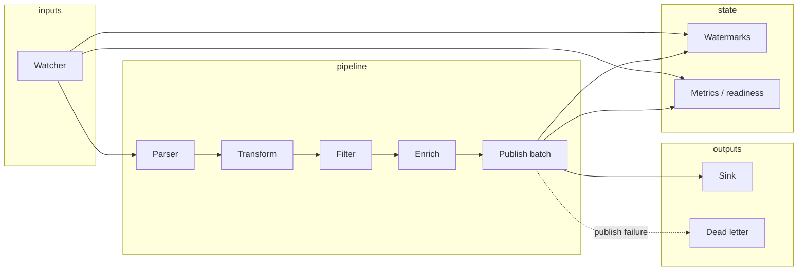

# Development

Repository layout and architecture for contributors. For running tests and smoke scripts, see [[Testing]]. For the PR workflow and CI checks, see [CONTRIBUTING.md](https://github.com/sanjuthomas/log-forwarder/blob/main/CONTRIBUTING.md) and [AGENTS.md](https://github.com/sanjuthomas/log-forwarder/blob/main/AGENTS.md).

## Architecture



**Pipeline order:** watcher → parser → transform → filter → enrich → publish batch → sink.

Watermarks advance only after a successful publish. Failed batches may spill to dead letter storage and trigger hibernate mode (see [[Monitoring]] and [[Watermarks and Restarts]]).

## Project layout

```
cmd/log-forwarder/          Main entrypoint (built-in components only)
configs/                    Example YAML configs
examples/custom/            Custom binary with registered extensions
examples/kafka/             Kafka security example configs
internal/
  config/                   YAML load, validation, type registries
  watcher/                  File tailing, rotation, line events
  parser/                   line, multiline parsers
  transform/                delimiter, regex, tab transformers
  filter/                   field, compound predicates
  enrich/                   static, host enrichers
  pipeline/                 Orchestration, publish batch, dead letter, hibernate
  sink/                     kafka, file, http-noauth (+ Register for custom)
  state/                    Watermark persistence
  metrics/                  OpenTelemetry → Prometheus HTTP, readiness, dead letters API
  deadletter/               Dead letter spill files and metadata
  runner/                   Concurrent watcher + pipeline lifecycle
  atc/                      Optional instance registration (log-forwarder-atc)
  integration/              End-to-end tests (excluded from per-package coverage gate)
  logging/                  Forwarder diagnostic logging
  timestamp/                Timestamp normalization helpers
scripts/                    lint, coverage gate, copyright, smoke tests
wiki/                       Wiki source (synced to GitHub Wiki on merge to main)
```

All production code lives under `internal/`. There is no stable public Go API — extension authors import `internal/*` within this module (same pattern as `examples/custom/`).

## Local checks (mirror CI)

```bash
./scripts/lint.sh
./scripts/check-copyright-header.sh
./scripts/check-coverage.sh    # each internal/* package ≥80%
go mod tidy && git diff --exit-code go.mod go.sum
go test ./...
go test -race ./...
go build -o bin/log-forwarder ./cmd/log-forwarder
go build -o bin/log-forwarder-custom ./examples/custom
```

Optional before Kafka-related changes: `./scripts/kafka-smoke.sh`, `./scripts/kafka-deadletter-smoke.sh`.

## Custom extensions

Built-in parsers, transformers, enrichers, filters, and sinks register via `init()`. User extensions belong in a **custom binary** — see [[Custom-Extensions]] and `examples/custom/`.

## Wiki changes

Wiki source lives in `wiki/` and syncs to GitHub Wiki on merge to `main`. Edit files under `wiki/` in your PR; do not edit the GitHub Wiki UI directly (changes would be overwritten).
