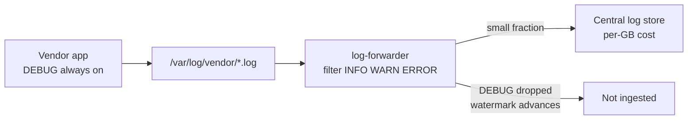

# Filtering Vendor Noise

Use the **filter** stage to drop low-value log levels **before** records reach a paid centralized store — when a vendor or legacy system logs heavily at DEBUG and you cannot change its settings.

## The problem

You run a third-party appliance on infrastructure you manage but **do not own the application**:

- Payment gateway, legacy ERP, medical device gateway, telco OSS box, etc.
- Vendor ships with **DEBUG enabled** and asks you not to turn it off (support troubleshooting).
- The app logs every heartbeat, retry, token validation, and internal state transition at DEBUG.
- You forward everything to Datadog, Splunk, Elastic Cloud, Grafana Cloud Logs, or similar — billed **per GB ingested**.

Typical volume split:

| Level | Share of lines | Useful in prod triage? |
|-------|---------------:|------------------------|
| DEBUG | ~85–95% | Rarely |
| INFO | ~5–10% | Sometimes |
| WARN | ~1% | Yes |
| ERROR | &lt;1% | Yes |

You control the **mount point** where the vendor writes logs. You do **not** control the vendor log level. DEBUG still lands on local disk — but you should not pay your log SaaS to store it.

## The approach

Run log-forwarder on the host (or as a sidecar), parse the `level` field, and **drop DEBUG and TRACE at the edge**:



**What happens to filtered lines:**

- They are **read** from disk (the vendor wrote them).
- They are **not** enriched or published to your sink.
- **Watermarks still advance** — tailing does not stall or replay DEBUG on restart.
- Metric `log_forwarder_lines_filtered` increments for each dropped record.

See [[How It Works#The stages (in order)|How It Works]] and [[Configuration-Reference#filter|filter config]].

## Example config

Copy [`configs/example-vendor-filter-kafka.yaml`](https://github.com/sanjuthomas/log-forwarder/blob/main/configs/example-vendor-filter-kafka.yaml) for a tab-delimited vendor format shipped to Kafka:

```yaml
watch:
  poll: 1s
  paths:
    - /var/log/acme-gateway
  patterns:
    - "*.log"
  state:
    path: /var/lib/log-forwarder/acme-gateway-watermarks.json

parser:
  type: line

transform:
  type: delimiter
  delimiter: "\t"
  columns:
    - timestamp
    - level
    - logger
    - message
  on_error: wrap

filter:
  match: any
  rules:
    - type: field
      field: level
      op: in
      values: [INFO, WARN, ERROR]
      ignore_case: true

enrichers:
  - type: static
    fields:
      application_id: acme-payment-gateway
      environment: prod
      vendor: acme-corp
  - type: host

sink:
  type: kafka
  kafka:
    brokers: ["kafka.internal:9092"]
    topic: logs.prod.payments

pipeline:
  buffer_size: 4096
  on_full: block
```

**Sample vendor lines:**

```
2026-06-13 14:22:01.123	DEBUG	com.acme.AuthService	Validating token merchantId=44102
2026-06-13 14:22:01.124	INFO	com.acme.AuthService	Authorization approved amount=129.99
2026-06-13 14:22:01.125	WARN	com.acme.AuthService	Retry 2/3 downstream timeout
2026-06-13 14:22:01.130	ERROR	com.acme.AuthService	Settlement failed: connection reset
```

Only the INFO, WARN, and ERROR lines reach Kafka.

## Ingestion cost (illustrative)

Numbers depend on retention, compression, and line size — use this as order-of-magnitude planning:

| | Ship everything | Filter DEBUG at edge |
|--|----------------:|---------------------:|
| Raw volume on disk | ~50 GB/day | ~50 GB/day (vendor still writes DEBUG) |
| Ingested to SaaS | ~50 GB/day | ~2.5–5 GB/day |
| @ $2/GB/month retained | ~$3,000/month | ~$150–300/month |

Filtering 90%+ DEBUG before ingest is often a **10–20× reduction** in billable volume.

## Verify it is working

With `metrics.enabled: true`, check Prometheus on the forwarder:

```promql
# Fraction of lines dropped by filter (expect high on DEBUG-heavy boxes)
rate(log_forwarder_lines_filtered[5m])
  / rate(log_forwarder_lines_read[5m])

# Lines actually shipped
rate(log_forwarder_lines_published[5m])
```

If `lines_filtered / lines_read ≈ 0.9`, roughly 90% of lines are dropped **before** your billable ingest. See [[Monitoring#What-to-alert-on|What to alert on]].

## Trade-offs

| You gain | You give up |
|----------|-------------|
| Lower ingest and retention cost | No DEBUG in the central store |
| Faster searches (less noise) | Vendor support still uses **local** log files for DEBUG |
| Predictable WARN/ERROR signal | Temporary broader shipping needs a second process or config change |

**Incident playbook:** keep vendor DEBUG on disk locally. For a sev-1 that needs DEBUG in a central tool, either SSH to the host or run a **second forwarder process** without `filter` (or with a wider rule) to a cheap archive sink — two processes, two watermark files. See [[How It Works#One process, one sink|One process, one sink]].

## Unstructured vendor logs

If the appliance emits syslog-style text instead of tab-delimited fields:

```
Jun 13 14:22:01 host acme[8842]: DEBUG: heartbeat ok
```

Extract `level` with a regex transform, then apply the same filter:

```yaml
transform:
  type: regex
  pattern: '^(?P<timestamp>\w+ \d+ [\d:]+) (?P<host>\S+) (?P<logger>\S+): (?P<level>[A-Z]+): (?P<message>.*)$'

filter:
  match: any
  rules:
    - type: field
      field: level
      op: in
      values: [INFO, WARN, ERROR]
      ignore_case: true
```

## Related

- [[Built-in-Components#Built-in filters|Built-in filters]] — `field` and `compound` rule types
- [[Example Configs]] — all example YAML files
- [`configs/example-filter.yaml`](https://github.com/sanjuthomas/log-forwarder/blob/main/configs/example-filter.yaml) — WARN/ERROR filter with file sink (integration-tested)
- [[Monitoring]] — `log_forwarder_lines_filtered` and alert guidance
