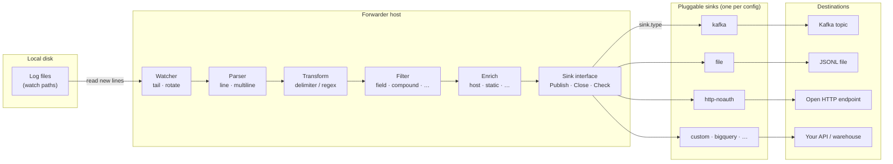

# log-forwarder — User Guide

**log-forwarder** tails log files, parses and transforms lines into structured JSON, optionally **filters** records with predicate rules, enriches them with metadata, and publishes them through a **pluggable sink** to the destination you configure.

The pipeline always ends at the same `sink.Sink` interface. `sink.type` in config selects the implementation; only one sink is active at runtime. Register additional types (for example `http-oauth2` or BigQuery streaming) in a custom binary — see [[Custom-Extensions]].

The [repository README](https://github.com/sanjuthomas/log-forwarder/blob/main/README.md) is a short index; **this wiki** has the full documentation.

## Wiki index

| Topic | Page |
|-------|------|
| Install, build, run | [[Installation and First Run]] |
| Pipeline overview | [[How It Works]] |
| YAML config (overview) | [[Configuration Guide]] |
| YAML config (full reference) | [[Configuration-Reference]] |
| Config key catalog (what / when) | [[Config-Catalog]] |
| Kafka, file, HTTP sinks | [[Choosing a Sink]] |
| Spring Boot / multiline logs | [[Spring Boot Logs]] |
| Watermarks, rotation, restarts | [[Watermarks and Restarts]] |
| Built-in parsers, transforms, filters | [[Built-in-Components]] |
| Custom parsers, sinks, filters | [[Custom-Extensions]] |
| Metrics, health, alerts | [[Monitoring]] |
| Unit, integration, smoke tests | [[Testing]] |
| Docker images and smoke tests | [[Docker]] |
| Production deployment | [[Deployment]] |
| Repo layout (contributors) | [[Development]] |
| Example configs | [[Example Configs]] |
| Common problems | [[Troubleshooting]] |

## Important rules of thumb

1. **One process → one sink.** Run separate processes with separate watermark files to fan out to multiple destinations.
2. **Watermarks are per process and per source file**, not per sink.
3. **Default `pipeline.on_full: block`** in production; `drop` causes permanent log loss under overload.
4. **`copytruncate` log rotation is not supported** — use rename/create rotation.
