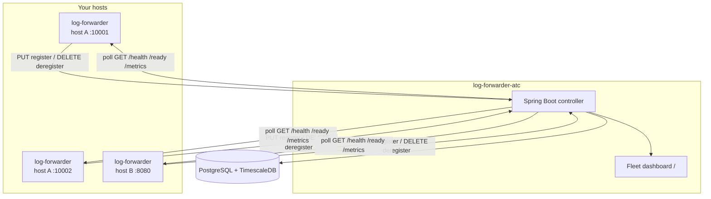

# Log Forwarder ATC

**[log-forwarder-atc](https://github.com/sanjuthomas/log-forwarder-atc)** is the optional fleet controller for log-forwarder agents. Agents register on startup; ATC stores registry data in PostgreSQL, polls each agent for health/readiness/metrics, and serves a built-in **fleet dashboard**.

This page describes the **agent side** (this repo). For ATC installation, API reference, dashboard, and database setup, see the **[log-forwarder-atc README](https://github.com/sanjuthomas/log-forwarder-atc)**.

## When to use ATC

| Use ATC when | Skip ATC when |
|--------------|---------------|
| You run many forwarders across hosts and want a central registry | You have one or two agents and Prometheus/Grafana is enough |
| Ops wants a quick fleet health view without wiring every scrape target | You already scrape `/metrics` per instance in Kubernetes |
| You need reachability + ready state in one dashboard | Registration overhead is not worth it for your scale |

ATC is **optional**. Log forwarding works with `atc.enabled: false` (the default).

## How the two repos fit together



| Component | Repository | Role |
|-----------|------------|------|
| **log-forwarder** | [sanjuthomas/log-forwarder](https://github.com/sanjuthomas/log-forwarder) | Tails logs, exposes `/health`, `/ready`, `/metrics`; `PUT`/`DELETE` to ATC at process boundaries |
| **log-forwarder-atc** | [sanjuthomas/log-forwarder-atc](https://github.com/sanjuthomas/log-forwarder-atc) | Registry, 30s polling, metric snapshots, fleet dashboard |

Each live agent is keyed by **`hostname` + `metrics.port`**, so multiple forwarders on one host are supported when they use different ports.

## Quick start (both repos)

### 1. Start ATC

From the **[log-forwarder-atc](https://github.com/sanjuthomas/log-forwarder-atc)** repo:

```bash
git clone https://github.com/sanjuthomas/log-forwarder-atc.git
cd log-forwarder-atc
docker compose up -d --build
```

Open **http://localhost:8090/** for the fleet dashboard. Default ATC API: `http://localhost:8090/api/instances`.

See the ATC README for local development (Maven), TimescaleDB, and configuration.

### 2. Enable registration on an agent

From this repo, start with [`configs/example-atc.yaml`](https://github.com/sanjuthomas/log-forwarder/blob/main/configs/example-atc.yaml) for a minimal local setup (file sink + metrics on port 8080), or [`configs/example-spring-boot-kafka.yaml`](https://github.com/sanjuthomas/log-forwarder/blob/main/configs/example-spring-boot-kafka.yaml) for Spring Boot + Kafka:

```yaml
metrics:
  enabled: true
  host: 0.0.0.0          # must be reachable by hostname when ATC runs remotely
  port: 10001

atc:
  enabled: true
  url: http://localhost:8090/api/instances
  # timeout: 5s          # optional; per PUT/DELETE call
```

`atc.enabled` requires `metrics.enabled`. Build and run:

```bash
go build -o bin/log-forwarder ./cmd/log-forwarder
./bin/log-forwarder -config configs/example-spring-boot-kafka.yaml
```

The agent appears on the ATC dashboard after registration. Health, readiness, and metrics refresh on ATC's poll cycle (default **30 seconds**).

## Agent responsibilities

| When | Forwarder action | ATC action |
|------|------------------|------------|
| **Startup** | One `PUT` with hostname, port, process_id, timestamp | Stores instance; SSE notifies dashboard |
| **Running** | No ATC traffic | Polls `GET /health`, `GET /ready`, `GET /metrics` |
| **Shutdown** | One `DELETE` with same identity | Removes from live registry; keeps deregister history |

Registration payload (`PUT`):

```json
{
  "hostname": "app-server-01",
  "port": 10001,
  "process_id": 12345,
  "timestamp": "2026-06-11T14:30:00.123456789Z"
}
```

`/health` and `/ready` responses include the same `process_id` so ATC can detect PID reuse on a port. See [[Monitoring#Endpoints|Monitoring endpoints]].

## Probe contract (what ATC expects)

ATC polls the **registered port** on the agent hostname:

| Probe | URL | Success |
|-------|-----|---------|
| Health | `http://{hostname}:{port}/health` | HTTP 2xx + JSON with matching `process_id` |
| Ready | `http://{hostname}:{port}/ready` | HTTP 2xx + JSON with matching `process_id` |
| Metrics | `http://{hostname}:{port}/metrics` | HTTP 2xx + Prometheus/OpenMetrics text |

Metrics ATC parses for the dashboard include `log_forwarder_files_watched`, `log_forwarder_lines_published_total`, `log_forwarder_pipeline_buffer_depth`, `log_forwarder_publish_hibernating`, and process gauges. Full list: **[ATC README — Agent contract](https://github.com/sanjuthomas/log-forwarder-atc#agent-contract-expected-by-atc)** and [[Monitoring#5-metrics-reference|Metrics reference]].

## Failure behavior (does not block forwarding)

| Situation | Forwarder | ATC |
|-----------|-----------|-----|
| ATC unreachable at startup | WARN `atc registration status status=failed`; **tailing continues** | Unaware of instance |
| ATC unreachable while running | No action | Last poll state ages |
| ATC unreachable at shutdown | WARN `status=deregistration_failed`; shutdown completes | May show stale instance |
| `kill -9` / crash | No `DELETE` | Stale registration until manual cleanup / future TTL |

There is **no mid-run re-register**. Restart the forwarder after ATC is back to register again.

Log lines to watch:

```
atc registration status status=registering ...
atc registration status status=registered ...
atc registration status status=failed ... error=...
atc registration status status=deregistering ...
atc registration status status=deregistered ...
```

## Configuration reference

| Key | Description |
|-----|-------------|
| `atc.enabled` | Register/deregister at process boundaries (default `false`) |
| `atc.url` | Full `PUT`/`DELETE` endpoint (default `http://localhost:8090/api/instances`) |
| `atc.timeout` | HTTP timeout per registration call (default `5s`) |

Requires `metrics.enabled`. See [[Configuration-Reference#atc|`atc` in Configuration Reference]] and [[Config-Catalog#atc--log-forwarder-atc-registration|Config Catalog]].

## Production notes

- **Network:** ATC must reach each agent's `metrics.host`:`metrics.port` by **hostname**. In Docker/Kubernetes, use a hostname or service name ATC can resolve — not only `127.0.0.1` on the agent if ATC runs elsewhere.
- **Security:** `/health`, `/ready`, and `/metrics` are unauthenticated. Restrict the management port with firewall rules or network policy; do not expose it on the public internet.
- **Multiple agents per host:** Use a unique `metrics.port` per process (for example `10001`, `10002`).
- **Observability split:** Use ATC for fleet reachability and a quick dashboard; keep Prometheus scraping `/metrics` for alerts and SLOs. They complement each other.

## Related

| Topic | Location |
|-------|----------|
| ATC install, API, dashboard, TimescaleDB | **[log-forwarder-atc README](https://github.com/sanjuthomas/log-forwarder-atc)** |
| Metrics, `/ready` semantics, alerts | [[Monitoring]] |
| Example config with ATC enabled | [`configs/example-atc.yaml`](https://github.com/sanjuthomas/log-forwarder/blob/main/configs/example-atc.yaml) (minimal), [`configs/example-spring-boot-kafka.yaml`](https://github.com/sanjuthomas/log-forwarder/blob/main/configs/example-spring-boot-kafka.yaml) (Spring Boot + Kafka) |
| Deployment (systemd, paths) | [[Deployment]] |
| Agent package (`internal/atc/`) | [[Development]] |
